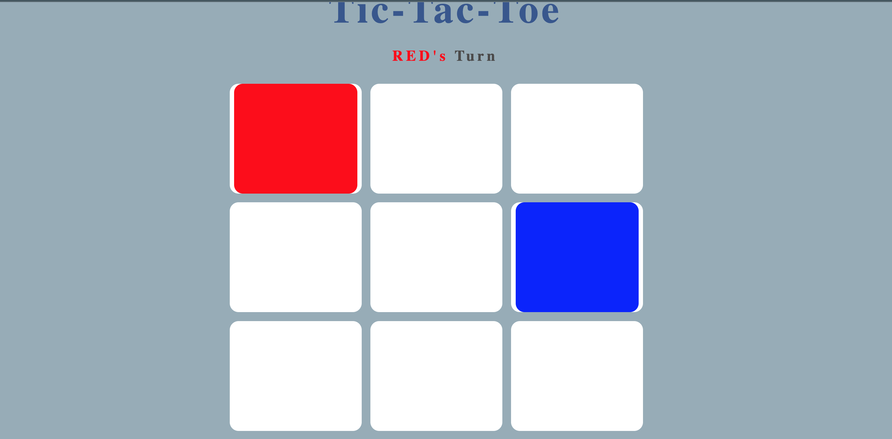

# Tic-Tac-Toe

## About
---
In essense, the game of tic-tac-toe is painfully simple. My rendition of the classic game is no exception. The only major deviation from the original is my use of the colors "red" and "blue" as opposed the traditional x's and o's.

---

## Screenshots
---

---

## Tech Used
---

-HTML

-CSS (Flexbox)

-Vanilla Javascript

This game utilizes the DOM API and MVC design pattern.

---
